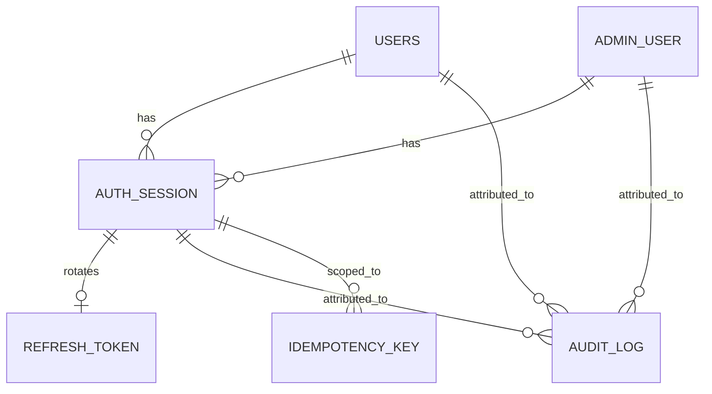

# Backend Service — Entity Relationship Model

**Status:** This does not replace `docs/erd.md` (repo root), which remains
authoritative for the `app` schema's domain entities. This document layers
on top of it: what the backend service reads/writes in `app`, plus the new
tables it owns for its own concerns (sessions, audit, idempotency).

## 1. Precondition: resolve existing drift first

Before writing the data-access layer, fold the following into a canonical
schema baseline (do this once, in `backend/db/`, per that folder's own
tooling — not inside this service):

- Migrations `0014_geo_hierarchy.sql`–`0017_agent_area_id.sql` (the six geo
  tables and `agent.area_id`) into `backend/db/app_schema.sql`. A fresh
  `apply_app_schema.dart --yes` today omits them.
- The `admin` role used in `shieldweb`/`AuthContext.tsx` vs. the schema's
  `app.admin_role` enum (`SUPERADMIN`, `PHARMACY`, `LAB`, `APPOINTMENTS`) —
  pick one vocabulary and use it in both the DB and the new auth module.
- `app.customer_review_video` (from migration `0009`) vs. its absence from
  the rebuilt DDL snapshot.

Building the identity and geo modules (see [frd.md](frd.md) §1, §8) against
unresolved drift means the backend inherits ambiguity that's cheaper to fix
once, up front, in the schema itself.

## 2. Existing `app` schema — entity groups this service reads/writes

Unchanged from `docs/erd.md` (repo root); repeated here for reference only:

| Group | Entities |
| --- | --- |
| Identity | `users`, `member_address`, `patient`, `device_push_token`, `notification` |
| Storefront | `shield_store`, categories, `product`, details, FAQs, banners, promos, articles, reviews |
| Commerce | `cart`, `cart_line`, `order`, `order_line`, tracking, receipt, `bill`, payment method |
| Prescription | `prescription`, `prescription_medicine`, `prescription_order`, `approval`, `approval_item` |
| Wallet | `wallet`, `wallet_card`, `wallet_entry`, membership tiers/loads |
| Rewards | `reward_point_transaction`, `referral`, `referral_level` |
| Care | `lab_package`, `lab_profile`, `lab_booking`, booking patients, `clinic`, `clinic_doctor`, `dietitian`, `appointment` |
| Partners | `agent`, `agent_request`, agent customer/plan/withdrawal/transfer, `investor`, investor plan requests |
| Geography | `region`, `state`, `district`, `assembly`, `lsgd`, `ward` |
| Ops | `admin_user` |

The DDL in `backend/db/app_schema.sql` remains authoritative for column-level
detail. This service must not fork or duplicate that definition.

## 3. New tables this service owns

| Table | Purpose | Key columns |
| --- | --- | --- |
| `backend.auth_session` | One row per active login (member or staff) | `id`, `subject_type` (`MEMBER`/`STAFF`), `subject_id`, `issued_at`, `expires_at`, `revoked_at`, `user_agent`, `ip` |
| `backend.refresh_token` | Rotatable refresh tokens, one active per session | `id`, `session_id` FK, `token_hash`, `expires_at`, `used_at` |
| `backend.audit_log` | Append-only record of mutating actions on sensitive tables | `id`, `actor_type`, `actor_id`, `action`, `entity_table`, `entity_id`, `before` (jsonb, nullable), `after` (jsonb, nullable), `created_at` |
| `backend.idempotency_key` | Dedupe retried mutating requests (wallet, agent withdrawal/transfer, checkout) | `key` (client-supplied), `session_id`, `endpoint`, `response_snapshot` (jsonb), `created_at`, unique on `(key, endpoint)` |

Deliberately a **separate `backend` schema**, not `app` — this is
service-owned operational state, not member/store domain data, and keeping
it apart avoids ever conflating "backend infra tables" with "domain tables"
in a future `app_schema.sql` recreation.

### Why not reuse `app.admin_user` as the session store directly

`app.admin_user` stays as the staff identity/role record (per
`docs/erd.md`'s stated intent for that table). `backend.auth_session` is the
ephemeral session layer on top of it — same relationship as `app.users` to
Firebase identity today, just applied consistently to both member and staff
login instead of only to members.

## 4. Integrity rules this service must add

- `backend.auth_session.revoked_at` must be checked on every request, not
  just at token-issue time (supports "log out all devices").
- `backend.audit_log` writes happen in the same transaction as the mutation
  they describe — never fire-and-forget after the fact, or a failed audit
  write could silently under-report a real change.
- `backend.idempotency_key` entries expire (e.g. 24h) and are cleaned up by a
  background job, not kept forever.
- All rules from `docs/erd.md` (repo root) §4 continue to apply and are now
  enforced at this service's API boundary instead of only being documented
  intent: `agent.area_id` polymorphic resolution, `agent_request` as the only
  path to a new `agent` row, wallet ledger append-only semantics, soft-delete
  respected for users/addresses/patients/prescriptions.
