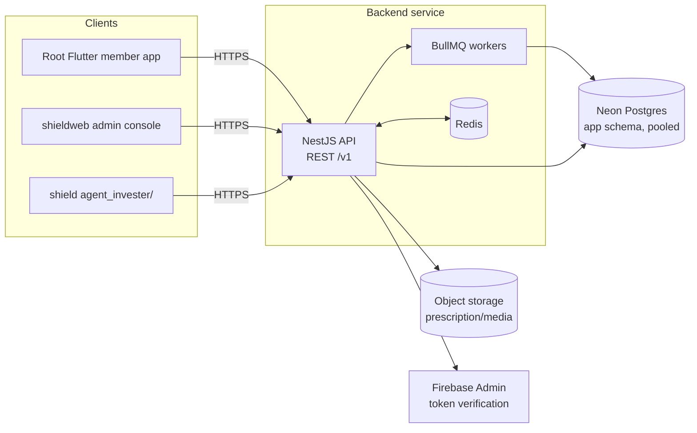

# Backend Service — Technical Requirements

## Architecture



One deployable service, internally modular by domain (see
[project-structure.md](project-structure.md)), not a service-per-client
split — see the reasoning already captured in `docs/decision-log.md`-style
discussion: the three clients share one schema and overlapping business
rules, so splitting by frontend would triplicate authorization logic on data
that isn't even partitioned.

`backend/db/` tooling (schema DDL, migrations, seed scripts) keeps its
existing direct Neon connection — it is infrastructure tooling, not a client
of this API, and continues to be the source of truth for schema changes.

## Non-functional requirements

| Requirement | Target | Rationale |
| --- | --- | --- |
| Availability | 99.5%+ | Consumer health/commerce app; not a hard real-time system |
| p95 API latency | < 300ms for reads, < 600ms for writes | Comfortably achievable for a CRUD-shaped workload at the traffic this system expects |
| Scale target | 100k MAU translated to design load: ~15-20k DAU, low hundreds of req/s at peak | See prior architecture discussion; this is a moderate-traffic system, not web-scale — horizontal scaling of stateless API instances is sufficient, no microservices needed |
| DB connections | Bounded pool per instance (e.g. 10-20), routed through Neon's pooler | Replaces today's unbounded per-client-connection model, which is the actual scaling risk, not backend language choice |
| Data durability | No wallet/ledger mutation without an appended, immutable entry row | Money correctness is non-negotiable |
| Auditability | Every mutating admin/staff action logged with actor, action, before/after where feasible | Required for health data (prescriptions) and financial data (wallet, agent commissions) |

## Request flow

1. Client sends HTTPS request with a bearer token (mobile) or session cookie
   (admin console).
2. Auth guard verifies the token/session; attaches the resolved identity
   (user id, role, branch/store scope) to the request context.
3. Authorization guard checks the resolved identity against the route's
   required role/scope before the handler runs.
4. Handler validates the request body against a Zod schema.
5. Domain service executes business logic, hitting Redis for cacheable reads
   and Postgres (via Drizzle, pooled connection) for the rest.
6. Mutating requests that touch money, prescriptions, or agent state also
   write an audit-log entry in the same transaction.
7. Response is serialized against a typed DTO; errors use a consistent
   envelope (see [api-spec.md](api-spec.md)).

## Security architecture

Full detail in [security.md](security.md). Summary:

- No client ever holds a Neon credential after migration completes.
- Member identity: Firebase ID token verified server-side → backend session.
- Staff identity: Firebase (email/password) verified the same way as member
  tokens → backend session; replaces the static credential list in
  `shieldweb/src/config/admins.ts`. No password hash lives in Postgres.
- Authorization: role + branch/store scope checked on every route via guards,
  not left to client-side conditionals.
- Rate limiting: Redis-backed, applied to auth, OTP, and financial mutation
  endpoints specifically, not just globally.
- Secrets: environment variables via the hosting platform's secret store;
  never committed, never bundled into a client.

## Data access layer

- Drizzle ORM against Neon's pooled connection string.
- One schema module per domain (see [project-structure.md](project-structure.md)),
  each exposing typed query/command functions — no raw SQL string
  concatenation outside the schema layer.
- Migrations authored via drizzle-kit, reviewed as SQL diffs, applied the
  same deliberate way `backend/db/apply_migration.dart` already works — this
  service does not get its own casual schema-recreate path; destructive
  operations require the same explicit confirmation discipline as
  `docs/database.md` already mandates for `backend/db/`.
- Known drift (unfolded geo migrations 0014-0017, `agent.area_id`) is folded
  into a canonical schema baseline before the backend's data layer is
  written against it — do this once, not per-module.

## Background jobs

BullMQ (Redis-backed) queues for anything that shouldn't block a request:

- OTP dispatch (if the backend ever originates OTP sends server-side, rather
  than purely verifying Firebase tokens).
- Push notification fan-out (`device_push_token`, `notification`).
- Reward-point accrual/expiry sweeps.
- Agent-approval side effects (e.g. notifying the recruit once approved).
- Report/dashboard pre-aggregation for the admin console, so heavy queries
  don't run synchronously on request.

## Observability

- Structured logs (pino) with a request-correlation ID, shipped to whatever
  aggregator is chosen; never log full request bodies for
  prescription/wallet/auth endpoints (PII/health data risk).
- OpenTelemetry traces across API → Postgres/Redis calls.
- Sentry for exceptions.
- A `/healthz` liveness endpoint and a `/readyz` readiness endpoint (checks
  DB and Redis connectivity) for the hosting platform's health checks.

## Deployment topology

- Containerized (Docker), deployed to Fly.io or Render, region close to
  Neon's `ap-southeast-1`.
- At least two API instances behind the platform's load balancer for
  availability; horizontally scalable on CPU/connection metrics.
- A separate worker process (same image, different entrypoint/command) for
  BullMQ consumers, scaled independently of the API instances.
- Redis as a managed instance (Upstash, or the hosting platform's managed
  Redis) — do not self-host Redis for this team size.
- CI (GitHub Actions): lint → typecheck → unit test → integration test
  (against a disposable Neon branch) → build → deploy on merge to a release
  branch, mirroring the discipline already implied by `AGENTS.md`'s
  validation section for the rest of the repo.

## Environment configuration

All secrets via environment variables, never committed:

```
DATABASE_URL=              # Neon pooled connection string, this service only
REDIS_URL=
FIREBASE_PROJECT_ID=
FIREBASE_ADMIN_CREDENTIALS=  # service-account JSON, secret-store only, never in repo
JWT_ACCESS_SECRET=
JWT_REFRESH_SECRET=
OBJECT_STORAGE_ENDPOINT=
OBJECT_STORAGE_BUCKET=
OBJECT_STORAGE_ACCESS_KEY=
OBJECT_STORAGE_SECRET_KEY=
SENTRY_DSN=
NODE_ENV=
PORT=
```

An `.env.example` with these keys (no values) ships in the service's root,
same convention as the repo root's `.env.example`.

## Rollout / rollback

See [migration-plan.md](migration-plan.md) for the phased client cutover.
At the infrastructure level: every deploy is a new container image tagged by
commit SHA; rollback is redeploying the previous image tag. Database
migrations are additive-first (new tables/columns nullable or defaulted)
so a rollback of the API never requires a matching down-migration on a
shared, live schema.
