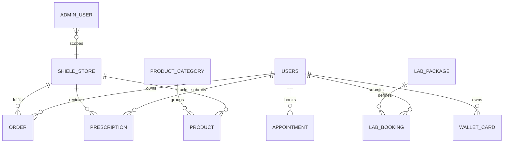

# Admin Console ERD

The console reads and mutates the shared `app` schema. The complete model is [Combined ERD](../../erd.md).

The logical `ADMIN_USER` scope shown here reflects intended branch authorization; current client-side filtering is not sufficient integrity enforcement. Reconcile the console `admin` role with the database enum before implementing server auth.
