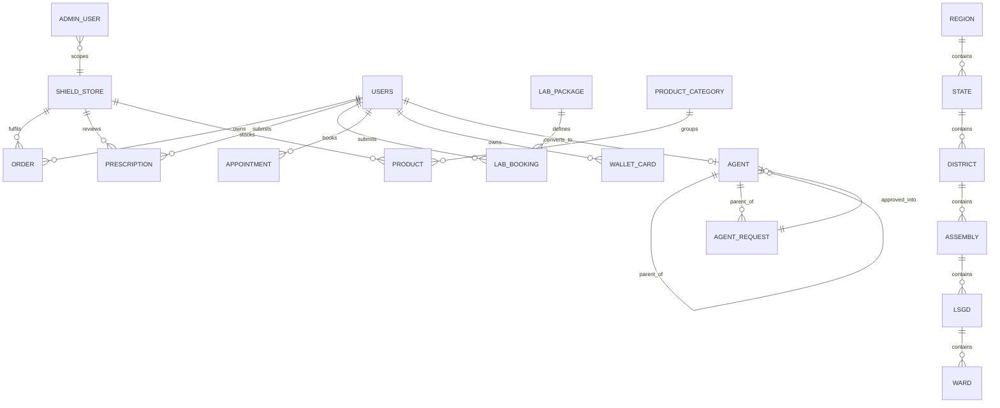

# Admin Console ERD

The console reads and mutates the shared `app` schema. The complete model is [Combined ERD](../../erd.md).

The logical `ADMIN_USER` scope shown here reflects intended branch authorization; current client-side filtering is not sufficient integrity enforcement. Reconcile the console `admin` role with the database enum before implementing server auth.

Two agent-facing surfaces write `AGENT`: `AgentApprovalsPage`/`AgentApprovalDetailPage` (`src/api/agents.ts`) approve or reject an app-submitted `AGENT_REQUEST` into a real row, and `UserDetailPage`'s "Convert to agent" (`src/api/users.ts convertToAgent`) creates one directly for an existing member. Both must resolve a named slot (`AGENT.area_id`) from the `REGION`→`WARD` chain (`src/api/geo.ts`) for every level below national — a slot already held by an approved agent is refused.
