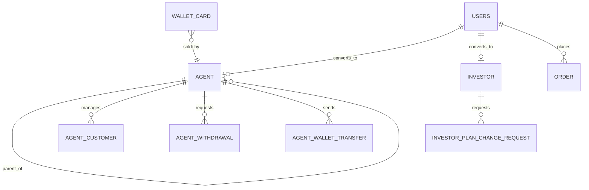

# Agent / Investor App ERD

The partner app reads the shared `app` schema. The complete model is [Combined ERD](../../erd.md).

Persona ownership is resolved through the member phone and optional `member_id` relationships. Partner financial values need server-side authorization, auditability, and domain review before being treated as production accounting.
