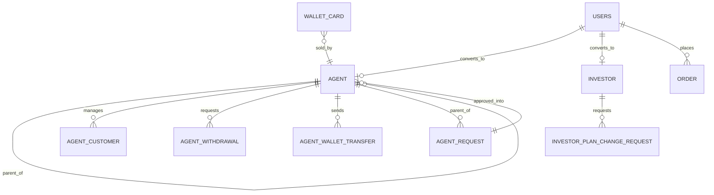

# Agent / Investor App ERD

The partner app reads the shared `app` schema. The complete model is [Combined ERD](../../erd.md).

Persona ownership is resolved through the member phone and optional `member_id` relationships. Partner financial values need server-side authorization, auditability, and domain review before being treated as production accounting.

Recruiting a lower-tier agent (`AgentService.registerAgent`, real Firebase OTP proven first) never writes `AGENT` directly — it inserts an `AGENT_REQUEST` row (status `PENDING`) via `AgentRepository.insertAgentRequest`. Until an admin approves it in the web console, the recruit shows in the app's team tree as a locked card (name + a reference code, no chevron) — `AgentRepository.fetchPendingRequests` folds these into the roster alongside real `AGENT` rows. The app also reads `region`/`state`/`district`/`assembly`/`lsgd`/`ward` (`AgentGeo`, `agent_geo_repository.dart`) to offer the named slot (`AGENT.area_id`) a recruit at region level or below must pick — see [Combined ERD](../../erd.md) for that hierarchy.
