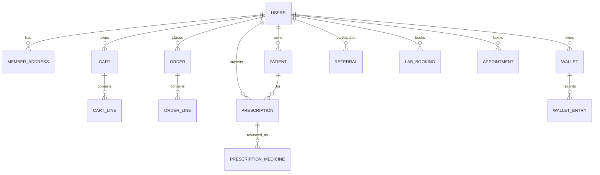

# Member App ERD

The member app uses the shared `app` schema. The complete logical model is [Combined ERD](../../erd.md); this is the member-owned slice.

Key branch relationship: `users.home_store_id -> shield_store.id`; orders and prescriptions also carry branch context. The DDL at `backend/db/app_schema.sql` is authoritative.
