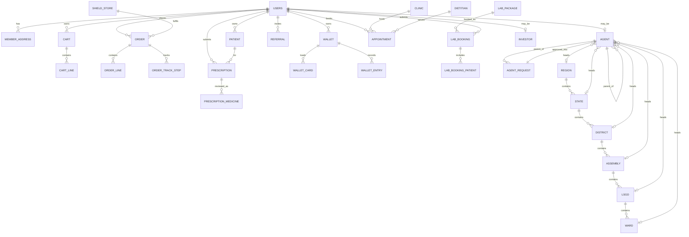

# SHIELD Entity Relationship Document

**Status:** Logical ERD derived from `backend/db/app_schema.sql` and `backend/db/APP_SCHEMA.md`. The SQL DDL remains authoritative.

## 1. Schema boundary

- `app`: customer/member data used by Flutter and the operations console.
- `public`: separate Prisma-managed system; do not infer app ownership from its tables.

## 2. Logical relationship map

## 3. Entity groups

| Group | Entities | Purpose |
| --- | --- | --- |
| Identity | `users`, `member_address`, `patient`, `device_push_token`, `notification` | Member identity, dependants, contact, notifications |
| Storefront | `shield_store`, categories, `product`, details, FAQs, banners, promos, articles, reviews | Product and editorial discovery |
| Commerce | `cart`, `cart_line`, `order`, `order_line`, tracking, receipt, payment method | Purchase lifecycle |
| Prescription | `prescription`, `prescription_medicine`, `prescription_order`, `approval`, `approval_item` | Prescription review and fulfilment |
| Wallet | `wallet`, `wallet_card`, `wallet_entry`, membership tiers and loads | Privilege plan accounting |
| Rewards | `reward_point_transaction`, `referral`, `referral_level` | Points and referral progression |
| Care | `lab_package`, `lab_profile`, `lab_booking`, booking patients, `clinic`, `clinic_doctor`, `dietitian`, `appointment` | Labs and appointments |
| Partners | `agent`, `agent_request`, agent customer/plan/withdrawal/transfer, `investor`, investor plan requests | Agent and investor programmes |
| Geography | `region`, `state`, `district`, `assembly`, `lsgd`, `ward` | Fixed administrative hierarchy an agent's slot (`agent.area_id`) resolves into |
| Operations | `admin_user` | Staff identity/role model intended by schema |

## 4. Integrity rules

- `users.phone` is the member identity key; `firebase_uid` links Firebase identity.
- `users.home_store_id` assigns a default branch.
- Pharmacy operations require a store scope; server-side enforcement is still required.
- `agent.parent_id` is self-referencing and supports the configured hierarchy.
- `agent.area_id` is a polymorphic reference (no DB-level FK) into whichever geo table `agent.level` implies — `region`/`state`/`district`/`assembly`/`lsgd`/`ward` — resolved app-side; NULL for the national agent or a free-text-place agent. See migration `0017_agent_area_id.sql`.
- `agent_request` holds an app-submitted recruitment awaiting admin review (`status`: PENDING/APPROVED/REJECTED); approving one inserts the real `agent` row and links `agent_request.agent_id` back to it. A registration never writes `agent` directly.
- The geo hierarchy (`region → state → district → assembly → lsgd → ward`) is loaded from `backend/db/seed_kerala_geo.dart`, not hardcoded; `region.national_agent_id` points at the single national-tier agent.
- Wallet money and ledger records must not be silently overwritten by UI actions.
- Soft-delete columns must be respected for users, addresses, patients, and prescriptions.

## 5. Known ERD drift

- Migration `0009_customer_review_videos.sql` creates `app.customer_review_video`, while the rebuilt app DDL snapshot does not include it.
- The console source has an `admin` role, while the schema enum currently lists `SUPERADMIN`, `PHARMACY`, `LAB`, and `APPOINTMENTS`.
- `backend/db/app_schema.sql` (the canonical recreate-from-scratch DDL) already carries `agent_request` (folded in from `shield agent_invester/backend/db/migrations/0011_agent_request.sql`), but does **not** define `agent.area_id` or the `region`/`state`/`district`/`assembly`/`lsgd`/`ward` tables at all — those only exist in the live database via this repo's own `backend/db/migrations/0014_geo_hierarchy.sql`, `0015_seed_regions_states.sql`, `0016_seed_kerala_districts.sql`, and `0017_agent_area_id.sql`. Running `apply_app_schema.dart --yes` against a fresh database today would recreate `agent`/`agent_request` but without `area_id` or the geo tables an agent's slot depends on — all of `0014`/`0017` needs folding into `app_schema.sql` before that command is trustworthy again.
- These mismatches require an ADR and migration decision before production authorization is implemented.
